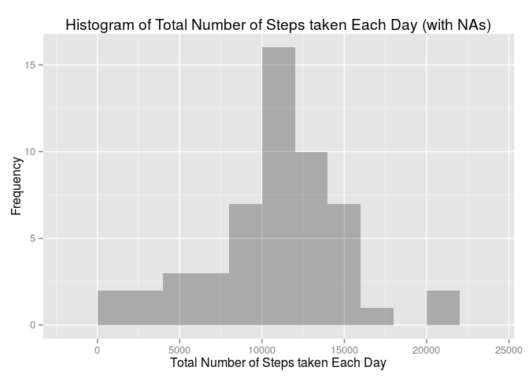
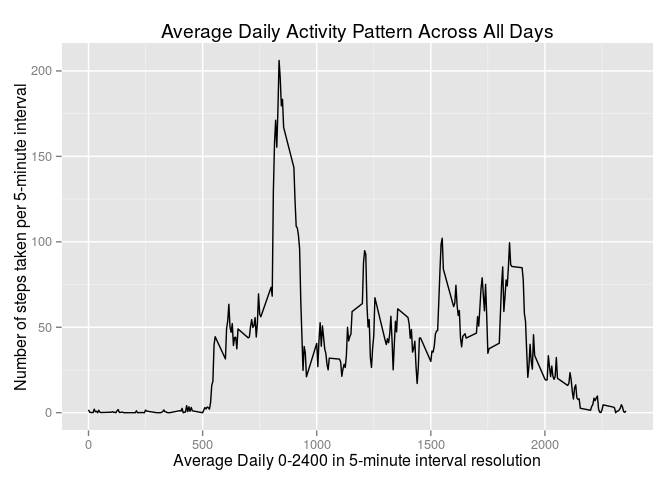
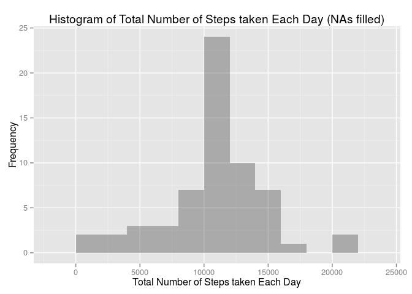
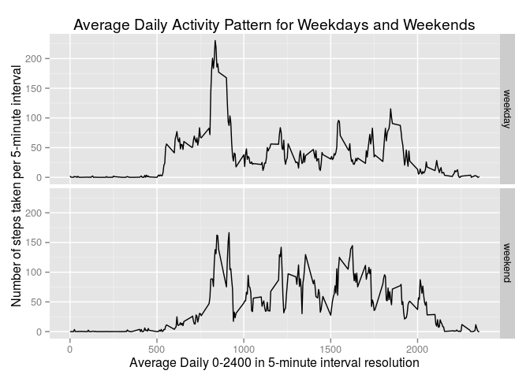

# Reproducible Research: Peer Assessment 1
FxCebx  

This is the Peer assessment 1 for Coursera course Reproducible Research.
Documentation for this Assessment can be found in README.md.  

> ### Data
>
> The variables included in dataset activity.zip are:
>
> * **steps**: Number of steps taking in a 5-minute interval (missing
>     values are coded as `NA`)
> 
> * **date**: The date on which the measurement was taken in YYYY-MM-DD
>    format
> 
> * **interval**: Identifier for the 5-minute interval in which
>    measurement was taken

The dataset is stored in a comma-separated-value (CSV) file and there
are a total of 17,568 observations in this
dataset.


### Load Packages

```r
require(data.table, quietly= TRUE)
require(ggplot2, quietly= TRUE)
require(xtable, quietly= TRUE)
require(dplyr, quietly= TRUE)
```

```
## 
## Attaching package: 'dplyr'
## 
## The following objects are masked from 'package:data.table':
## 
##     between, last
## 
## The following object is masked from 'package:stats':
## 
##     filter
## 
## The following objects are masked from 'package:base':
## 
##     intersect, setdiff, setequal, union
```

## Loading and preprocessing the data

Unzip the data file in current R working directory.


```r
unzip(zipfile="activity.zip")
```

Read the CSV file and
convert the data frame to a data table using the data.table package 
(Variable dt is still a data frame).

```r
dt <- data.table(read.csv("activity.csv"))
```

Convert the date variable YYYY-MM-DD into a date class.
Show the structure and the dataset (with the package data.table the dataframe is printed
very nicely :-) ).


```r
dt$date <- as.Date(dt$date)
str(dt)
```

```
## Classes 'data.table' and 'data.frame':	17568 obs. of  3 variables:
##  $ steps   : int  NA NA NA NA NA NA NA NA NA NA ...
##  $ date    : Date, format: "2012-10-01" "2012-10-01" ...
##  $ interval: int  0 5 10 15 20 25 30 35 40 45 ...
##  - attr(*, ".internal.selfref")=<externalptr>
```

```r
dt
```

```
##        steps       date interval
##     1:    NA 2012-10-01        0
##     2:    NA 2012-10-01        5
##     3:    NA 2012-10-01       10
##     4:    NA 2012-10-01       15
##     5:    NA 2012-10-01       20
##    ---                          
## 17564:    NA 2012-11-30     2335
## 17565:    NA 2012-11-30     2340
## 17566:    NA 2012-11-30     2345
## 17567:    NA 2012-11-30     2350
## 17568:    NA 2012-11-30     2355
```

## What is mean total number of steps taken per day?

Aggregate the number of steps taken each day.
Days with missing values NA will have NA when aggregated.


```r
dtDaily <- dt[, list(sumSteps = sum(steps, na.rm= FALSE)), date]
head(dtDaily)
```

```
##          date sumSteps
## 1: 2012-10-01       NA
## 2: 2012-10-02      126
## 3: 2012-10-03    11352
## 4: 2012-10-04    12116
## 5: 2012-10-05    13294
## 6: 2012-10-06    15420
```

Plot a histogram of the total number of steps taken each day.


```r
ggplot(dtDaily, aes(x=sumSteps)) +
  geom_histogram(alpha=1/3, binwidth=2000) +
  xlab("Total Number of Steps taken Each Day") + 
  ylab("Frequency") +
  labs(title= "Histogram of Total Number of Steps taken Each Day (with NAs)")
```

 

Calculate and report the **mean** and **median** total number of steps taken per day.
Count also total number of days and number of days without NAs.


```r
dtDailyNAs <- dtDaily[, list(NrDays = .N, NrDayswithoutNAs = sum(!is.na(sumSteps)), 
                             Mean = mean(sumSteps, na.rm= TRUE),     
                             Median = median(sumSteps, na.rm= TRUE))]
```

Use xtable to make a nice html table. 


```r
print(xtable(dtDailyNAs), type="html", include.rownames=TRUE)
```

<!-- html table generated in R 3.1.2 by xtable 1.7-4 package -->
<!-- Sun Dec 14 21:40:01 2014 -->
<table border=1>
<tr> <th>  </th> <th> NrDays </th> <th> NrDayswithoutNAs </th> <th> Mean </th> <th> Median </th>  </tr>
  <tr> <td align="right"> 1 </td> <td align="right">  61 </td> <td align="right">  53 </td> <td align="right"> 10766.19 </td> <td align="right"> 10765 </td> </tr>
   </table>
  
>  
> The **mean** total number of steps taken per day is 10766.19. 
>
> The **median** total number of steps taken per day is 10765.
>

## What is the average daily activity pattern?

Aggregate the average daily number of steps taken per 5-minute interval.


```r
# dtavg <- aggregate(x=list(steps=dt$steps), by=list(interval=dt$interval),
#                      FUN=mean, na.rm=TRUE)
# it's the same
dtavg <- aggregate(steps ~ interval, data= dt, mean, na.rm= TRUE)
```

Plot a time series of the 5-minute interval and the average number of steps taken across all days.


```r
ggplot(data=dtavg, aes(x=interval, y=steps)) +
    geom_line() +
    xlab("Average Daily 0-2400 in 5-minute interval resolution") +
    ylab("Number of steps taken per 5-minute interval") + 
    labs(title= "Average Daily Activity Pattern Across All Days")
```

 

Which 5-minute interval, on average across all the days in the dataset, contains the maximum number of steps?

```r
maxnrsteps <- dtavg[which.max(dtavg$steps), ]
maxnrsteps$steps <- round(maxnrsteps$steps)
maxnrsteps
```

```
##     interval steps
## 104      835   206
```
The person's daily activity peaks around 8:35am. 

Thats the prominent peak from the above plot.

## Imputing missing values
There are a number of days/intervals where there are missing
values (coded as `NA`). The presence of missing days may introduce
bias into some calculations or summaries of the data.


Calculate and report the total number of missing values in the dataset (i.e. the total number of rows with `NA`s)

```r
dtDailyNAs
```

```
##    NrDays NrDayswithoutNAs     Mean Median
## 1:     61               53 10766.19  10765
```


```r
how_many_NAs <- sum(is.na(dt$steps))
how_many_Zeros <- sum(dt$steps== 0, na.rm= TRUE)
cbind(how_many_NAs, how_many_Zeros)
```

```
##      how_many_NAs how_many_Zeros
## [1,]         2304          11014
```

In the dataset are in total  **2304** number of rows with `NA`s.

Only the rows with `NA`s are getting filled in.

**The strategy for filling in all of the missing values in the dataset is**

* filling each missing single row of a 5 minute interval with the average daily number of steps taken per 5-minute interval
(the average daily activity pattern).

Create a new dataset that is equal to the original dataset but with the missing data filled in.
Using the rounded mean of average steps taken per 5-minute interval from above.


```r
# add column average daily number of steps taken per 5minute interval
dt_filled <- cbind.data.frame(dt, dtavg[, 2])
# fill those steps with NAs with the rounded average daily number of steps taken per 5minute interval
dt_filled <- transform(dt_filled, steps=ifelse(is.na(steps), round(V2), steps))
# remove additional column
dt_filled <- select(dt_filled, -V2)
```


```r
how_many_NAs <- sum(is.na(dt_filled$steps))
how_many_Zeros <- sum(dt_filled$steps== 0, na.rm= TRUE)
cbind(how_many_NAs, how_many_Zeros)
```

```
##      how_many_NAs how_many_Zeros
## [1,]            0          11350
```

No `NA`s anymore, but some additional Zeros from small values of the average daily activity pattern.

Plot a histogram of the total number of steps taken each day with imputed missing data

```r
dtDaily_filled <- dt_filled[, list(sumSteps = sum(steps)), date]
head(dtDaily_filled)
```

```
##          date sumSteps
## 1: 2012-10-01    10762
## 2: 2012-10-02      126
## 3: 2012-10-03    11352
## 4: 2012-10-04    12116
## 5: 2012-10-05    13294
## 6: 2012-10-06    15420
```


```r
ggplot(dtDaily_filled, aes(x=sumSteps)) +
  geom_histogram(alpha=1/3, binwidth=2000) +
  xlab("Total Number of Steps taken Each Day") + 
  ylab("Frequency") +
  labs(title= "Histogram of Total Number of Steps taken Each Day (NAs filled)")
```

 

Calculate and report the **mean** and **median** total number of steps taken per day.
Count also total number of days and number of days without NAs.


```r
dtDailyNAsfilled <- dtDaily_filled[, list(NrDays = .N,  
                             Mean = mean(sumSteps), 
                             Median = median(sumSteps))]    # , na.rm=TRUE
```

Use xtable to make a nice html table. 


```r
print(xtable(dtDailyNAsfilled), type="html", include.rownames=TRUE)
```

<!-- html table generated in R 3.1.2 by xtable 1.7-4 package -->
<!-- Sun Dec 14 21:40:01 2014 -->
<table border=1>
<tr> <th>  </th> <th> NrDays </th> <th> Mean </th> <th> Median </th>  </tr>
  <tr> <td align="right"> 1 </td> <td align="right">  61 </td> <td align="right"> 10765.64 </td> <td align="right"> 10762.00 </td> </tr>
   </table>
  
>  
> The **mean** total number of steps taken per day is 10765.64. 
>
> The **median** total number of steps taken per day is 10762.


**Do these values differ from the estimates from the first part of the assignment? **

Not really, rounding the values that are filled in for `NA`s make these minor differences. 

**What is the impact of imputing missing data on the estimates of the total daily number of steps?**

The shape of the histogram is the same with and without `NA`s. The frequency counts increased as expected, after filling the `NA.  However, it can be said that the chosen strategy for imputing missing values does not negatively influence the significance of the data.


## Are there differences in activity patterns between weekdays and weekends?
First, let's find the day of the week for each measurement in the dataset. In
this part, we use the dataset with the filled-in values.

Doing some Housekeeping and set Language Time Settings to English 
(only necessary for non English LC_Time settings).


```r
# Sys.getlocale("LC_TIME")
local_LC_TIME <- Sys.getlocale("LC_TIME") # save local language time settings
Sys.setlocale("LC_TIME", "en_US.UTF-8")   # Modern Linux etc.
```

```
## [1] "en_US.UTF-8"
```

Create a new factor variable in the dataset with two levels -- "weekday" and "weekend" indicating whether a given date is a weekday or weekend day.


```r
weekday_weekend <- function(date) {
    day <- weekdays(date)
    if (day %in% c("Monday", "Tuesday", "Wednesday", "Thursday", "Friday"))
        return("weekday")
    else if (day %in% c("Saturday", "Sunday"))
        return("weekend")
    else
        stop("invalid date")
}
dt_filled$day <- sapply(dt_filled$date, FUN=weekday_weekend)
```

Aggregate the average daily number of steps taken per 5-minute interval.


```r
#dtavgf <- aggregate(x=list(steps=dt_filled$steps), by=list(interval=dt_filled$interval, day=dt_filled$day),
#                      FUN=mean, na.rm=TRUE)
# it's the same
dtavgf <- aggregate(steps ~ interval + day, data= dt_filled, mean)
```

Plot a time series of the 5-minute interval and the average number of steps taken for weekdays and weekends.


```r
ggplot(data=dtavgf, aes(x=interval, y=steps)) +
    facet_grid(day ~ .) +
    geom_line() +
    xlab("Average Daily 0-2400 in 5-minute interval resolution") +
    ylab("Number of steps taken per 5-minute interval") + 
    labs(title= "Average Daily Activity Pattern for Weekdays and Weekends")
```

 

There is some difference in activity pattern. The person is more active during the weekend, also starting later and the morning start is not so pronounced compared with during the weekdays.
